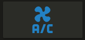

# Animation Ready Advanced Button Card by  <!-- keep in toc -->


An animation ready dashboard Button card that really looks alive. Custom made for your entities.

43 New Animations in custom button card!


## TOC <!-- omit in toc -->

- [Features](#features)

  - [Styles](#styles)
    - [Easy styling options](#easy-styling-options)
    - [Light entity color variable](#light-entity-color-variable)
    - [ADVANCED styling options](#advanced-styling-options)
  - [2022 Demo Card](#2022-demo-card)

  - [Manual Installation](#manual-installation)

- [Examples](#examples)
  - [bounce](#bounce)
  - [2022 New Animations] (#2022-new-animations)

    - [blink](#blink)
    - [zoomInRight](#zoomInRight)

 
  - [Changing the feedback color during a click](#changing-the-feedback-color-during-a-click)

- [Credits](#credits)

## Features


- 43 New Animations for 2022 (#newanis)


## Configuration


### Styles

Bounce Animation[bounce](#bounce)

A

#### Easy styling options

For each element in the card, styles can be defined in 2 places:


```yaml
button_card_templates:
  glass_morphism:
    variables:
      blur_amount: blur(6px)
    styles:
      card:
        - display: inline-block
        - padding: 2px
        - border: 0
        - text-decoration: none
        - border-radius: .8em
        - background-color: rgba(255,255,255,0.1)
        - border: 1px solid ivory
        - backdrop-filter: '[[[ return variables.blur_amount ]]]'
        - color: rgba(255,255,255,0.8)
        - font-size: 1em
        - letter-spacing: 0px
        - text-transform: capitalize
        - height: 7em
        - box-shadow: 8px 8px 14px black
      state:
        - font-weight: 900
        - letter-spacing: normal
      icon:
        - transform: scale(2)
        - color: ivory
      name:
        - font-weight: bolder
        - font-size: .8em
      label:
        - font-size: 0.7em
        - white-space: normal
    state:
      - value: 'on'
        styles:
          card:
            - background: var(--primary-color)
            - opacity: 0.8
            - box-shadow: 8px 8px 10px black
            - border: 2px solid honeydew
```

This will render using the variable blur_amount: set the payload to blur(NumbeRpx)
to adjust the amount the background is blurred through the button.

- The `card` with the styles `xxxx: value` **and** `yyyy: value` applied
- Same for all the others.


Examples are better than a long text, so here you go:


[2022 New Animations](#2022-new-animations)

After you replace buttoncard.js with mine add a the new helper from the input_select.yaml file in this repository
Then you could paste this card into lovelace to try out some animations.
#### 2022 Demo Card

To use this card:
1. download buttoncard.js from here and place it in your home assistant 
2. add a the animations helper available above in input_select.yaml
3. paste the following card into a dashboard (lovelace page)

```yaml

type: vertical-stack
cards:
  - type: entities
    entities:
      - entity: input_select.animation
      - entity: sun.sun
    title: Choose an Animation
    state_color: true
  - type: horizontal-stack
    cards:
      - type: custom:button-card
        entity: sun.sun
        show_name: false
        show_label: true
        label: '[[[ return states["input_select.animation"].state; ]]]'
        styles:
          card:
            - height: 6em
            - background: darkgoldenrod
            - animation: '[[[ return states["input_select.animation"].state; ]]]'
            - animation-duration: 8s
          icon:
            - color: lawngreen
          label:
            - color: yellow
            - font-weight: 600
            - font-size: 250%
      - type: custom:button-card
        entity: sun.sun
        name: Hey There!
        show_name: true
        styles:
          card:
            - height: 7em
            - background: crimson
          icon:
            - animation: '[[[ return states["input_select.animation"].state; ]]]'
            - animation-duration: 15s
            - color: lemonchiffon
          name:
            - color: red
            - font-weight: 600
            - font-size: 150%
            - text-shadow: 2px 2px black
            - background: dimgray
            - transform: rotate(90deg)
            - left: 10px
            - top: 10px
            - postion: relative
            - padding: 8px
            - border-radius: 2px
            - box-shadow: 4px 4px 8px black
            - animation: '[[[ return states["input_select.animation"].state; ]]]'
            - animation-duration: 2.5s


```
#### 2022 New Animations
Using new animations is the same as any
```yaml

      type: custom:button-card
      entity: sun.sun
      show_state: true
      show_name: true
      show_label: true
      label: Animate Me
      styles:
        card:
          - width: 8em
          - height: 8em # make the card circle
          - border-radius: 50%
          - animation: rollIn 8s linear 1 # rollIn lasting 8s normal 1 time
          - border: 2px dashed red
          - outline: 2px dashed blue
          - outline-offset: -5px
        icon:
          - animation: jackInTheBox 18s ease-in 10 8s # do animation 10 times but wait 8s for the card to roll in 
        label:
          - animation: wobble 4s linear infinite 30s
```
### Configuration Templates

#### General

- Define your config template in the main lovelace configuration and then use it in your button-card. This will avoid a lot of repetitions! It's basically YAML anchors, but without using YAML anchors and is very useful if you split your config in multiple files 😄  
- You can overload any parameter with a new one
- You can merge states together **by `id`** when using templates. The states you want to merge have to have the same `id`. This `id` parameter is new and can be anything (string, number, ...). States without `id` will be appended to the state array. Styles embedded in a state are merged together as usual. See [here](#merging-state-by-id) for an example.
- You can also inherit another template from within a template.
- You can inherit multiple templates at once by making it an array. In this case, the templates will be merged together with the current configuration in the order they are defined. This happens recursively.

  ```yaml
  type: custom:button-card
  template:
    - template1
    - template2
  ```

  The button templates will be applied in the order they are defined: `template2` will be merged with `template1` and then the local config will be merged with the result. You can still chain templates together (ie. define template in a button-card template. It will follow the path recursively).

Make sure which type of lovelace dashboard you are using before changing the main lovelace configuration:
  * **`managed`** changes are managed by lovelace ui - add the template configuration to configuration in raw editor
      * go to your dashboard
      * click three dots and `Edit dashboard` button 
      * click three dots again and click `Raw configuration editor` button
  * **`yaml`** - add template configuration to your `ui-lovelace.yaml`

```yaml
button_card_templates:
  header:
    styles:
      card:
        - padding: 5px 15px
        - background-color: var(--paper-item-icon-active-color)
      name:
        - text-transform: uppercase
        - color: var(--primary-background-color)
        - justify-self: start
        - font-weight: bold
      label:
        - text-transform: uppercase
        - color: var(--primary-background-color)
        - justify-self: start
        - font-weight: bold

  header_red:
    template: header
    styles:
      card:
        - background-color: '#FF0000'

  my_little_template: [...]
```

And then where you use button-card, you can apply this template, and/or overload it:

```yaml
- type: custom:button-card
  template: header_red
  name: My Test Header
```
#### 2022 New ANIMATIONS

No need to use extra styles with these new ones. the new animations are embedded right into button-card.
List coming soon!

[zoomInRight](#zoomInRight)
```yaml
  card:
    - animation: zoomInRight 5s linear 1 .5s
```


#### Variables

You can add variables to your templates and overload them in the instance of your button card. This lets you easily work with templates without the need to redefine everything for a small change.
An example below:

```yaml
button_card_templates:
  variable_test:
    variables:
      var_name: "var_value"
      var_name2: "var_value2"
    name: '[[[ return variables.var_name ]]]'

[...]

- type: custom:button-card
  template: variable_test
  entity: sensor.test
  # name will be "var_value"

- type: custom:button-card
  template: variable_test
  entity: sensor.test
  variables:
    var_name: "My local Value"
 # name will be "My local Value"
```

## Installation

### Manual Installation

1. Download the [button-card](https://github.com/hobobobjoe/button-card/blob/master/button-card.js)
2. Place the file in your `config/www` folder
3. Include the card code in your `ui-lovelace-card.yaml`

   ```yaml
   title: Home
   resources:
     - url: /local/button-card.js
       type: module
   ```

4. Write configuration for the card in your `ui-lovelace.yaml`

### Installation and tracking with `hacs`

1. Not Available

   ```yaml
   resources:
     - url: /hacsfiles/button-card/button-card.js
       type: module
   ```

4. Refresh home-assistant.

## Examples

Show a button for the air conditioner (blue when on, `var(--disabled-text-color)` when off):



```yaml
- type: 'custom:button-card'
  entity: switch.ac
  icon: mdi:air-conditioner
  color: rgb(28, 128, 199)
```

Redefine the color when the state if off to red:

```yaml
- type: 'custom:button-card'
  entity: switch.ac
  icon: mdi:air-conditioner
  color: rgb(28, 128, 199)
  state:
    - value: 'off'
      color: rgb(255, 0, 0)
```

---

Show an ON/OFF button for the home_lights group:


```yaml
- type: 'custom:button-card'
  entity: group.home_lights
  show_icon: false
  show_state: true
```

---

Light entity with custom icon and "more info" pop-in:


```yaml
- type: 'custom:button-card'
  entity: light.living_room_lights
  icon: mdi:sofa
  color: auto
  tap_action:
    action: more-info
```

---

Light card with card color type, name, and automatic color:


```yaml
- type: 'custom:button-card'
  entity: light._
  icon: mdi:home
  color: auto
  color_type: card
  tap_action:
    action: more-info
  name: Home
  styles:
    card:
      - font-size: 12px
      - font-weight: bold
```

---

Horizontal stack with :

- 2x blank cards
- 1x volume up button with service call
- 1x volume down button with service call
- 2x blank cards


```yaml
- type: horizontal-stack
  cards:
    - type: 'custom:button-card'
      color_type: blank-card
    - type: 'custom:button-card'
      color_type: blank-card
    - type: 'custom:button-card'
      color_type: card
      color: rgb(223, 255, 97)
      icon: mdi:volume-plus
      tap_action:
        action: call-service
        service: media_player.volume_up
        service_data:
          entity_id: media_player.living_room_speaker
    - type: 'custom:button-card'
      color_type: card
      color: rgb(223, 255, 97)
      icon: mdi:volume-minus
      tap_action:
        action: call-service
        service: media_player.volume_down
        service_data:
          entity_id: media_player.living_room_speaker
    - type: 'custom:button-card'
      color_type: blank-card
    - type: 'custom:button-card'
      color_type: blank-card
```

---

Vertical Stack with :

- 1x label card
- Horizontal Stack with :
  - 1x Scene 1 Button
  - 1x Scene 2 Button
  - 1x Scene 3 Button
  - 1x Scene 4 Button
  - 1x Scene Off Button


```yaml
- type: vertical-stack
  cards:
    - type: 'custom:button-card'
      color_type: label-card
      color: rgb(44, 109, 214)
      name: Kitchen
    - type: horizontal-stack
      cards:
        - type: 'custom:button-card'
          entity: switch.kitchen_scene_1
          color_type: card
          color: rgb(66, 134, 244)
          icon: mdi:numeric-1-box-outline
        - type: 'custom:button-card'
          entity: switch.kitchen_scene_2
          color_type: card
          color: rgb(66, 134, 244)
          icon: mdi:numeric-2-box-outline
        - type: 'custom:button-card'
          entity: switch.kitchen_scene_3
          color_type: card
          color: rgb(66, 134, 244)
          icon: mdi:numeric-3-box-outline
        - type: 'custom:button-card'
          entity: switch.kitchen_scene_4
          color_type: card
          color: rgb(66, 134, 244)
          icon: mdi:numeric-4-box-outline
        - type: 'custom:button-card'
          entity: switch.kitchen_off
          color_type: card
          color: rgb(66, 134, 244)
          icon: mdi:eye-off-outline
```


#### blink

You can make the whole button blink:


```yaml
- type: 'custom:button-card'
  color_type: card
  entity: binary_sensor.intruder
  name: Intruder Alert
  state:
    - value: 'on'
      color: red
      icon: mdi:alert
      styles:
        card:
          - animation: blink 2s ease infinite
    - operator: default
      color: green
      icon: mdi:shield-check
```


### Changing the feedback color during a click

For dark cards, it can be usefull to change the feedback color when clicking the button. The ripple effect uses a `mwc-ripple` element so you can style it with the CSS variables it supports.

For example:

```yaml
styles:
  card:
    - --mdc-ripple-color: blue
    - --mdc-ripple-press-opacity: 0.5
```

## Community guides

- [robotnet.dk](https://robotnet.dk/2020/homekit-knapper-custom-buttons-home-assistant.html): Danish tutorial and how-to about using Lovelace Button card for your entities.

## Credits

- [ciotlosm](https://github.com/ciotlosm) for the readme template and some awesome examples
- [iantrich](https://github.com/iantrich), [LbDab](https://github.com/lbdab) and [jimz011](https://github.com/jimz011) for the inspiration and the awesome templates and cards you've created.


